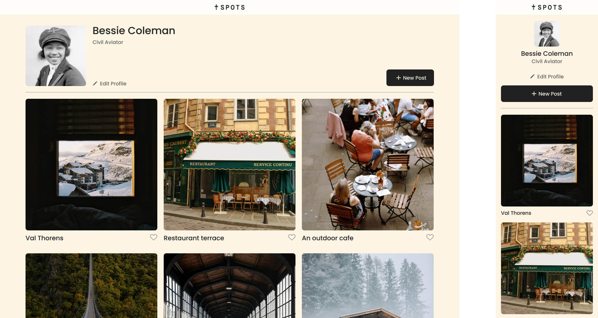

# Project 3: Spots
  
**About**
  
**Spots** is my responsive front-end web project from the tripleten SE Bootcamp that showcases a curated feed of image cards and user profile details in a clean and modern interface. It is structured using semantic HTML5, organized CSS, and follows the BEM (Block Element Modifier) naming convention for maintainable and scalable code. 

---

## ✨ Features

- Responsive layout optimized for desktop and mobile views
- User profile section with editable details
- Dynamic card grid displaying image posts
- Custom typography and modern design
- Deployed on GitHub Pages

---

## 🛠️ Technologies & Techniques Used

- **HTML5** for semantic structure
- **CSS3** for styling and layout
- **BEM (Block Element Modifier)** methodology for CSS class naming
- **Flexbox & CSS Grid** for responsive design
- **Custom fonts (Poppins)** via `@font-face` in `fonts.css`
- **Normalize.css** to ensure consistent styling across browsers
- **Git & GitHub Pages** for version control and deployment
  
**Preview**  
  

  
Good luck and have fun!

#🔗 Live Demo

🌐 [View the project on GitHub Pages](https://ivan-kwetey.github.io/se_project_spots/)
